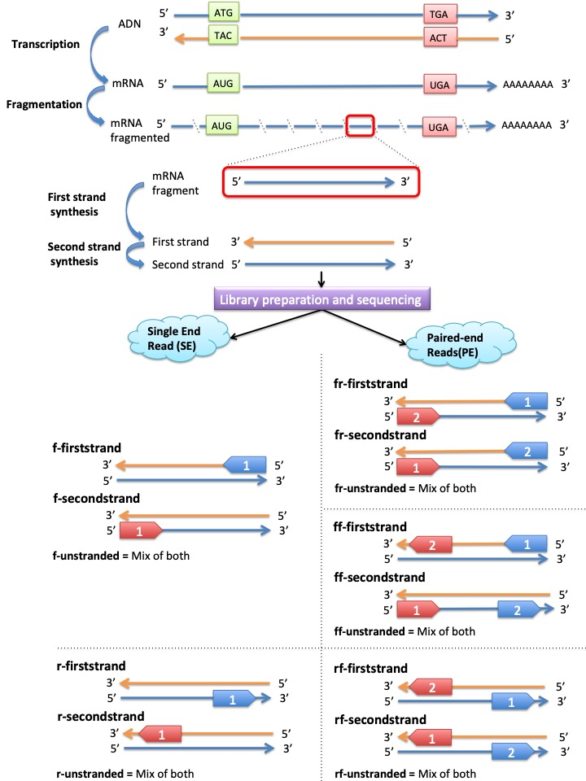

# Summary

Short-read RNA sequencing (RNA-seq) is a powerful approach allowing among others to investigate the expression of genes, to perform genome annotation, to detect the single nucleotide polymorphisms or look at the alternative gene spliced transcripts.
Sequenced reads have characteristics that differ according to the RNA-seq library preparation protocols used. i) the reads can be either single end (only one side of a fragment is sequenced) or paired-end (both ends of a fragment are sequenced); ii) the reads can be stranded (the information about which strand was originally transcribed is preserved) or unstranded; iii) the right-most end of the fragment is the first sequenced (or only sequenced for single-end reads) or the left-most end of the fragment is the first sequenced (or only sequenced for single-end reads); iv) paired-end reads can be inward or outward looking; v) paired-end reads can both come from the original RNA strand/template or from the opposite strand or even one comes from the original RNA strand/template and the other from the opposite strand (Figure 1). The information regarding the library type is helpful for improving the reads mapping to a reference assembly/genome or to assemble them into a transcriptome. This is because the library type can help to discern location of ambiguous reads by using the read’s relative orientation and from which strand it was sequenced. Unfortunately, this information regarding the library type used is not included in sequencing output files and can consequently be lost or miss-labelled before to be used the end user. Most of time it can be solved by contacting the parties involved in the generation of the RNA-seq data.  But when it's not possible, this might yield in a waste of resources and time. Indeed  one can launch the analysis with sub-optimum parameters, resulting in lower quality results or one can try to guess the library type with the available approaches: i) Using infer_experiment.py from the RSeQC package [@RSeQC], ii) Launching mappers with different parameters and compare the results; iii) mapping the reads and look at them within a genome browser; iv) using Salmon [@Salmon].
But none of them can guess the full information of the library type, they can require specific inputs (e.g. an annotation file), they can deal with only specific library types, or can be done only with substantial manual work.
GUESSmyLT aims to automate the different steps needed for identifying the RNA-Seq library type as comprehensively as possible, and can deal with any type of input data: from mapped reads, from raw reads, with or without annotation, with or without reference genome.
GUESSmyLT was developed as a snakemake pipeline consisting of three pre existing softwares (bowtie2 [@Bowtie], trinity [@Trinity] and busco [@Busco]) and an inference step at the end that performs the library type prediction.

# Figures

# Authors Contributions

Berner Wik E., Olin H. and Vigetun Haughey C. contributed equally to this work. 

# References
